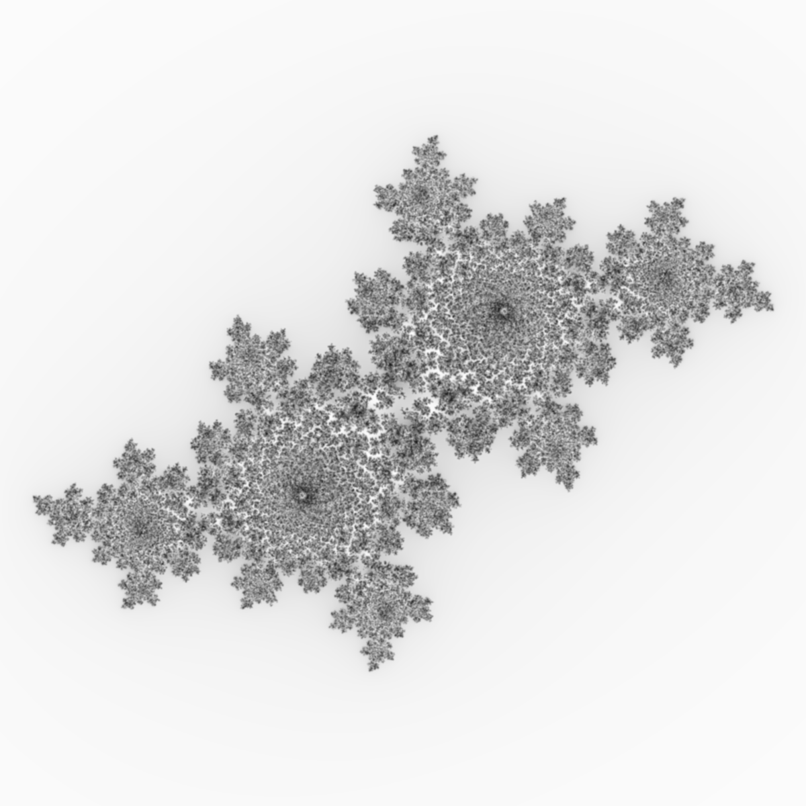
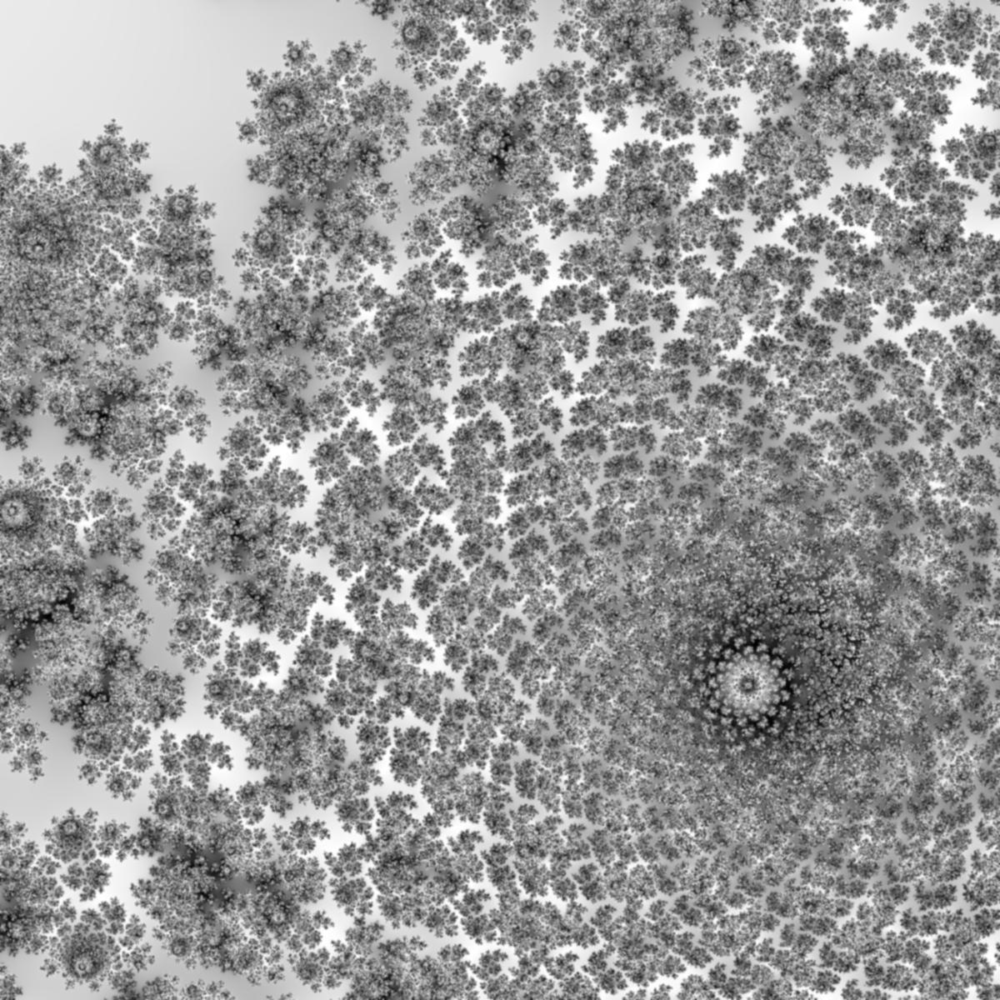
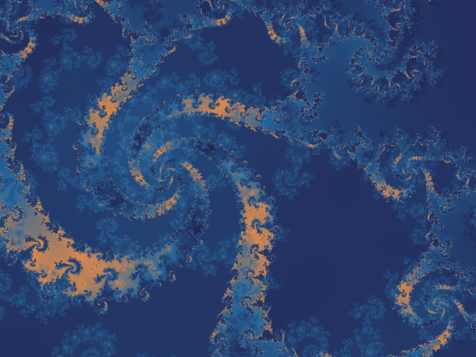

# juliafatou

* render julia sets blazingly fast
* two slightly different julia sets are rendered at the same time and combined using a simple algorithm to add more complexity
* can be used to generate desktop wallpapers

## Compiling

Compiling should be pretty straightforward using Cargo:

~~~bash
git clone "https://www.github.com/elkasztano/juliafatou" && \
cd juliafatou && \
cargo build --release
~~~

You can also just do ``cargo run --``, but then you won't have the optimization benefits and image rendering will be pretty slow.

## Usage

The program is used from the command line only. The following options and flags are available:

### ``-h, --help``

Print help text and exit.

### ``-V, --version``

Print version number and exit.

### ``-d, --dimensions <USIZExUSIZE>``

Dimensions of the output image. ``-d 1920x1080`` will result in a full HD image, ``-d 3840x2160`` will be 4K and so on.

### ``-o, --output-file <FILE>``

Output file in which the resulting image will be stored. Defaults to 'output.png' in the current directory. Existing files are overwritten without prompt.

### ``--config <FILE>``

Optional parameter. Specify a custom .csv-file that contains exactly three colors in rgb notation, e.g. three eight bit integer values (0-255) for each color, one color per row. The first line (csv header) will be ignored. The colors are then used to build the color gradient. (See example file 'colors.csv').

### ``-s, --offset <f64:f64>``

Shift the entire view to render the desired area of the julia/fatou set. 
 Required format: ``f64:f64`` (x:y)

Decreasing values will shift the view down and/or right, increasing values will shift up and/or left.

### ``-x, --scale <f64>``

Basically a magnification factor (64-bit float). The smaller the value, the more you zoom in. A value of 3.0 (default) will give you a full overview. A value of 0.1 may result in a very detailed image.

### ``--blur <f32>``

Image blur factor (32-bit float) used for post processing. Higher value means softer image. Defaults to 1.0. Typical values are in the range of 0.0 to 2.0.

### ``-w, --power <u8>``

The $x$ in the equation $z^x + c$. Defaults to 2. Only 8-bit unsigned integers are allowed. Typical values are 2, 3 or 4.

### ``-f, --factor <f64>``

Intensity factor of the second julia set, that is then added to the primary one. Typical values are in the range of -0.5 to 0.5. Providing negative values will actually substract the secondary julia set from the primary one.

### ``-c, --color-style <value_enum>``

Select color gradient. Possible values are: bookworm, jellyfish, ten, eleven, mint, greyscale, christmas, chameleon, plasma, plasma2, config, random.

Some of the above mentioned variants are actually intended to create desktop wallpapers for various operating systems.

Two special variants need to be mentioned:

#### config

Reads color information from the file 'colors.csv' in the local directory or from the file specified in the optional ``--config`` parameter.

#### random

Creates a random color gradient.

### ``-g, --diverge <f64>``

Difference between the primary julia set and the secondary one. The specified value (64-bit float) is added to the real part and subtracted from the imaginary part of the complex number $c$ in the equation $z^x + c$. Even minor changes can have dramatic effects. Typical values are below 0.1.

### ``-p, --complex <f64,f64>``

The $c$ in the equation $z^2 + c$. It is a complex number, so you actually have to specify both the real part and the imaginary part in the form of two 64-bit floats, separated by a comma. Defaults to ``-0.4,0.6``. Small changes can have dramatic effects, especially at higher zoom levels.

### ``-i, --intensity <f64>``

Overall multiplicative factor. Defaults to 3.0. You may try to increase this value if the resulting image is too low in contrast.

### ``--inverse``

Inverse the color gradient.

### ``--threads <usize>``

Number of threads used for computation (usize). Defaults to <i>available_parallelism</i>.

### ``--take-time``

If this flag is set, the overall computation time will be measured and displayed. File IO or post processing is not included in the measurement.

## Examples

Navigate to the crate's local directory (where you have cloned the repository), then type (or copy and paste) the following:

Without any arguments we get an image stored in <i>output.png</i>.

~~~bash
target/release/juliafatou
~~~

Shift the view and zoom in.

~~~bash
target/release/juliafatou --offset 0.5:-0.25 --scale 0.5 --output-file shiftzoom.png
~~~

Choose a color gradient and add some complexity.

~~~bash
target/release/juliafatou -d 800x600 -o example.png -p -0.486,0.587 -g 0.01 -f -0.2 -x 0.075 -w 3 --blur 0.5  -c plasma -s -0.78:-0.15
~~~

It really is a lot of trial and error. As mentioned above even small changes can have dramatic effects.

## Notes

I'm neither a mathematician nor a professional programmer. I'm just a hobbyist, who stumbled across the Rust programming language and it's amazing possibilities when it comes to concurrency.

## References

Programming Rust, 2nd Edition (2021) O'Reilly Media, Inc. ISBN 9781492052548

... and all crates used in this project and their respective documentation!
